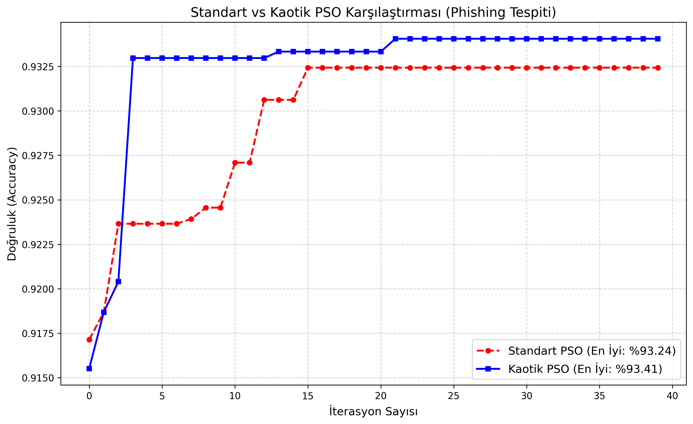

# Chaotic Initialized Binary PSO for Phishing Detection 🛡️


## 📌 Abstract
Phishing attacks are one of the most dangerous cyber threats targeting the "human" factor. Although machine learning offers promising solutions, high-dimensional data often leads to the **"Curse of Dimensionality"** and overfitting. 

This project introduces a novel feature selection approach: **Chaotic Initialized Binary Particle Swarm Optimization (K-BPSO)**. By integrating **Chaos Theory (Logistic Map)** into the standard PSO algorithm, this method overcomes the **"Premature Convergence"** problem, ensuring global optimization.

The proposed model was tested on **UCI Phishing** and **UCI Spambase** datasets, reducing the number of features by approximately **50%** while achieving **93.74%** accuracy.

---

## 🚀 Key Features
* [cite_start]**Chaotic Initialization:** Uses **Logistic Map** to initialize particles, preventing local optima traps[cite: 10].
* [cite_start]**Feature Selection:** Selects the most relevant subset of features to reduce computational cost[cite: 40].
* [cite_start]**Wrapper Method:** Uses **KNN (k=5)** as the fitness function evaluator[cite: 114].
* [cite_start]**Robust Validation:** Implements **5-Fold Cross-Validation** with strictly separated normalization to prevent **Data Leakage**[cite: 11, 81].
* **Benchmarking:** Compares **Standard BPSO** vs. **Chaotic BPSO** performance.

---

## 🛠️ Methodology: Why Chaos?

Standard Particle Swarm Optimization (PSO) relies on random initialization. [cite_start]However, in complex search spaces, particles often converge too early (Premature Convergence)[cite: 46]. 

To solve this, we utilized the **Logistic Map**, a chaotic map defined as:

$$z_{k+1} = \mu \cdot z_{k} \cdot (1 - z_{k})$$

where $\mu=4.0$ represents a fully chaotic state. [cite_start]This dynamic behavior allows the algorithm to explore the search space more homogeneously and escape local minima[cite: 106, 107].

### Convergence Comparison
*The graph below demonstrates how Chaotic PSO (Blue) continues to optimize after the Standard PSO (Red) gets stuck.*


*(Please ensure the image path matches your repo structure)*

---

## 📊 Results

[cite_start]The proposed method was evaluated on two benchmark datasets[cite: 62]:

| Dataset | Method | Accuracy | Feature Reduction | Std. Dev (Stability) |
| :--- | :--- | :--- | :--- | :--- |
| **UCI Phishing** | Standard BPSO | 93.63% | 48.0% | 0.0018 |
| **UCI Phishing** | **Chaotic BPSO** | **93.74%** | **45.6%** | **0.0016** |
| **UCI Spambase** | Standard BPSO | 91.18% | 53.0% | 0.0050 |
| **UCI Spambase** | **Chaotic BPSO** | **91.05%** | **53.7%** | **0.0037** |

* [cite_start]**High Accuracy:** Outperformed standard methods on the Phishing dataset[cite: 158].
* [cite_start]**Stability:** Lower standard deviation proves the model is reliable and consistent[cite: 160].
* [cite_start]**Efficiency:** Reduced features by ~50%, lowering CPU/Memory usage[cite: 161].

---

## 📂 Project Structure

```bash
├── data/                  # Raw datasets (UCI Phishing & Spambase)
├── processed_data/        # Cleaned and normalized CSV files
├── plots/                 # Generated convergence and distribution plots
├── src/
│   ├── pso_optimizer.py   # Core Algorithm (Standard & Chaotic BPSO Classes)
│   ├── main.py            # Main execution script
│   └── utils.py           # Helper functions (Data loading, plotting)
├── requirements.txt       # Python dependencies
└── README.md              # Project documentation
